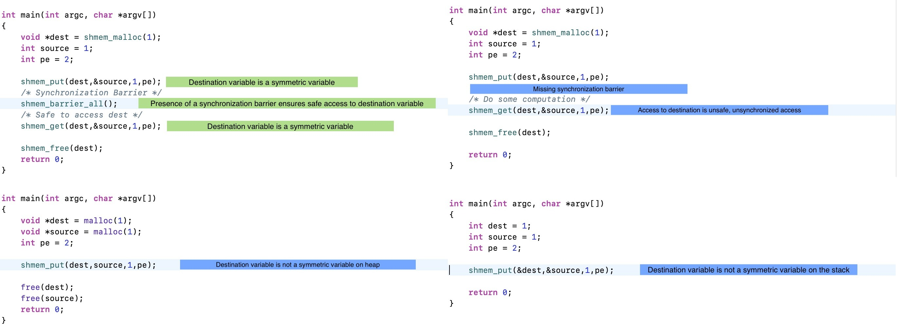

## OpenSHMEM Checker



**This is currently only experimental**

- The checker identifies if a variable is a symmetric variable.
- Checks is the destination variable is a symmetric variable.
- Catches unsynchronized access to variables via shmem_get.

## How to include the checker?
- Include your checker file in the `CMakeLists.txt` file
- Navigate to the build folder and `make clang -j CORES_NUM`

## Tests

- all_is_well.c : Correct Open Shmem Program
- destination_not_symmetric.c : Destination is not a symmetric variable
- unsynchronized_access.c :Unsynchronized access of shmem_get

```
cd tests
clang -Xanalyzer -analyzer-checker=core.OpenSHMEMChecker --analyze PROGRAM_TO_TEST open_shmem.c
```

## TODO

- Add proper bug report.
- Yet to add support for catching other synchronization mechanisms like quiet etc. 
- Synchronization mechanisms for symmetric variables allocated via static and global variables. 
